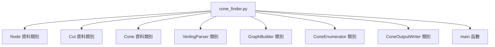
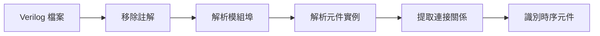
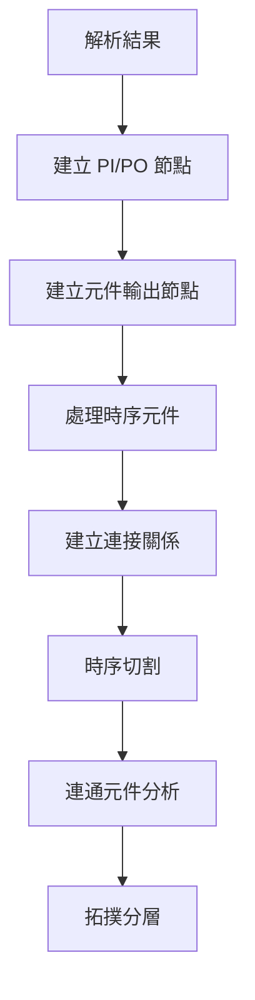

# LogicConeMiner 程式設計指南

本文件詳細說明 `cone_finder.py` 的內部架構、演算法實作和設計理念。

## 目錄
- [1. 程式整體架構](#1-程式整體架構)
- [2. 資料結構設計](#2-資料結構設計)
- [3. Verilog 解析模組](#3-verilog-解析模組)
- [4. 圖建構與時序切割](#4-圖建構與時序切割)
- [5. k-feasible Cuts 演算法](#5-k-feasible-cuts-演算法)
- [6. 多輸出錐群組化](#6-多輸出錐群組化)
- [7. 連通性與約束檢查](#7-連通性與約束檢查)
- [8. 去重與簽名機制](#8-去重與簽名機制)
- [9. 執行流程詳解](#9-執行流程詳解)

---

## 1. 程式整體架構

### 1.1 類別組織結構



### 1.2 模組依賴關係

```
VerilogParser ──解析──→ cells, nets, ports
                           │
                           ▼
GraphBuilder ──建圖──→ nodes, blocks
                           │
                           ▼
ConeEnumerator ──演算法──→ discovered_cones
                           │
                           ▼
ConeOutputWriter ──輸出──→ JSONL, Summary
```

### 1.3 核心設計原則

- **模組化**：每個類別負責單一職責
- **可擴展性**：支援不同 Verilog 格式和演算法變體
- **可測試性**：清晰的輸入輸出界面
- **效能平衡**：兼顧記憶體使用和執行速度

---

## 2. 資料結構設計

### 2.1 Node 類別 - 電路節點抽象

```python
@dataclass
class Node:
    id: str                    # 節點唯一識別符
    type: str                  # 節點類型
    fanin: List[str]          # 輸入連接列表
    fanout: List[str]         # 輸出連接列表
    is_seq: bool = False      # 時序元件標記
    is_pi: bool = False       # 主要輸入標記
    is_po: bool = False       # 主要輸出標記
    level: int = -1           # 拓撲層級
```

**設計考量：**
- 使用字串 ID 而非物件參考，避免循環參考問題
- 布林標記提供快速類型檢查
- `level` 欄位支援拓撲排序演算法

**節點類型範例：**
```python
# 組合邏輯閘
Node(id="u1.Y", type="AND2", fanin=["a", "b"], fanout=["u3.A"])

# 時序元件輸出
Node(id="ff1.Q", type="DFF", is_seq=True, fanout=["u2.A"])

# 主要輸入
Node(id="clk", type="PI", is_pi=True, fanout=["ff1.CLK", "ff2.CLK"])
```

### 2.2 Cut 類別 - k-feasible Cuts

```python
@dataclass
class Cut:
    leaves: Set[str]          # 前緣節點集合
    depth: int                # 最大路徑深度

    def dominates(self, other: 'Cut') -> bool:
        return (self.leaves <= other.leaves and self.depth <= other.depth and
                (self.leaves < other.leaves or self.depth < other.depth))
```

**支配關係：**
Cut C1 支配 Cut C2 當且僅當：
- `C1.leaves ⊆ C2.leaves` （葉集合更小或相等）
- `C1.depth ≤ C2.depth` （深度更小或相等）
- 至少一個條件嚴格成立

**裁剪效果：**
```python
cuts = [
    Cut({"a", "b"}, 2),       # 保留（最優）
    Cut({"a", "b", "c"}, 3),  # 移除（被支配）
    Cut({"a", "c"}, 2),       # 保留（不同葉集合）
]
```

### 2.3 Cone 類別 - 邏輯錐表示

```python
@dataclass
class Cone:
    cone_id: str              # 短 ID（簽名前綴）
    block_id: int             # 所屬區塊
    roots: List[str]          # 輸出節點
    leaves: List[str]         # 輸入節點
    depth: int                # 最大深度
    num_nodes: int            # 節點總數
    num_edges: int            # 邊總數
    connected: bool           # 連通性
    signature: str            # 完整簽名
    nodes: Set[str]           # 所有節點
```

**錐的結構特性：**
- **封閉性**：所有從內部節點到根的路徑都在錐內
- **前緣性**：葉節點在錐內無前驅
- **連通性**：無向視角下形成單一連通元件

---

## 3. Verilog 解析模組

### 3.1 VerilogParser 類別結構

```python
class VerilogParser:
    def __init__(self):
        self.cells = {}          # 元件實例
        self.nets = {}           # 網路連接
        self.ports = {}          # 埠定義
        self.seq_types = {...}   # 時序元件類型
```

### 3.2 解析流程



### 3.3 時序元件識別

**模式匹配策略：**
```python
seq_types = {
    'DFF', 'DFFR', 'DFFS', 'DFFSR',    # D 觸發器變體
    'SDFF', 'SDFFR',                    # 同步置位/重置
    'DLAT', 'DLATR', 'DLATS'           # 閘鎖變體
}

def is_sequential(self, cell_type: str) -> bool:
    cell_upper = cell_type.upper()
    return any(seq_pattern in cell_upper for seq_pattern in self.seq_types)
```

### 3.4 解析假設與限制

**支援的語法：**
- 結構化模組實例：`cell_type instance_name (connections);`
- 埠連接：`.port_name(net_name)`
- 簡單埠宣告：`input/output port_name`

**不支援的語法：**
- 行為式 `always` 區塊
- 複雜的匯流排宣告
- 參數化模組

---

## 4. 圖建構與時序切割

### 4.1 GraphBuilder 類別功能

```python
class GraphBuilder:
    def __init__(self, parser: VerilogParser):
        self.nodes: Dict[str, Node] = {}
        self.blocks: List[Set[str]] = []
        self.reverse_graph: Dict[str, Set[str]] = defaultdict(set)
```

### 4.2 建圖流程



### 4.3 時序切割策略

**切割原則：**
1. **FF/Latch 處理**：
   - `FF.Q` / `Latch.Q` → 偽主要輸入
   - `FF.D` / `Latch.D` → 偽主要輸出
   - 移除跨時序元件的邊

2. **PI/PO 處理**：
   - PI 作為來源節點
   - PO 作為匯點節點

**實作細節：**
```python
def sequential_cut_and_blocks(self):
    # 收集組合邏輯節點
    combinational_nodes = {
        node_id for node_id, node in self.nodes.items()
        if not node.is_seq and not node.is_pi and not node.is_po
    }

    # 建立組合邏輯邊
    edges = set()
    for node_id in combinational_nodes:
        for fanout_id in self.nodes[node_id].fanout:
            if fanout_id in combinational_nodes:
                edges.add((min(node_id, fanout_id), max(node_id, fanout_id)))

    # 使用 BFS 找連通元件
    self.blocks = self._find_connected_components(combinational_nodes, edges)
```

### 4.4 拓撲分層

**分層演算法：**
```python
def level_nodes_in_block(self, block: Set[str]):
    # 計算入度
    in_degree = {node_id: 0 for node_id in block}
    for node_id in block:
        for fanin_id in self.nodes[node_id].fanin:
            if fanin_id in block:
                in_degree[node_id] += 1

    # Kahn 演算法
    queue = deque([node_id for node_id in block if in_degree[node_id] == 0])
    level = 0

    while queue:
        # 處理當前層級的所有節點
        for _ in range(len(queue)):
            node_id = queue.popleft()
            self.nodes[node_id].level = level

            # 更新下游節點入度
            for fanout_id in self.nodes[node_id].fanout:
                if fanout_id in block:
                    in_degree[fanout_id] -= 1
                    if in_degree[fanout_id] == 0:
                        queue.append(fanout_id)

        level += 1
```

---

## 5. k-feasible Cuts 演算法

### 5.1 演算法概述

k-feasible cuts 演算法使用動態規劃來為每個節點計算所有可行的 cut，其中每個 cut 的葉節點數量不超過 k。

### 5.2 動態規劃狀態

**狀態定義：**
- `Cuts[v]`：節點 v 的所有可行 cut 集合
- 每個 cut 包含：`{leaves: Set[str], depth: int}`

**狀態轉移：**
```python
# 來源節點（無前驅）
if not fanins_in_block:
    Cuts[v] = [{leaves: {v}, depth: 0}]

# 一般節點
else:
    Cuts[v] = []
    for cut_combination in cartesian_product(Cuts[fanin] for fanin in fanins):
        merged_cut = merge_cuts(cut_combination)
        if is_feasible(merged_cut, K, max_depth):
            Cuts[v].append(merged_cut)

    Cuts[v] = prune_dominated(Cuts[v])
    Cuts[v] = limit_size(Cuts[v], max_cuts_per_node)
```

### 5.3 Cut 合併演算法

```python
def merge_cuts(cut_combination):
    merged_leaves = set()
    max_fanin_depth = 0

    for cut in cut_combination:
        merged_leaves.update(cut.leaves)
        max_fanin_depth = max(max_fanin_depth, cut.depth)

    # 計算閘延遲
    gate_cost = 0 if (not count_inverters and
                     node.type.upper() in ['INV', 'BUF']) else 1
    new_depth = max_fanin_depth + gate_cost

    return Cut(leaves=merged_leaves, depth=new_depth)
```

### 5.4 支配裁剪

**裁剪策略：**
```python
def prune_dominated_cuts(cuts: List[Cut]) -> List[Cut]:
    pruned = []
    for i, cut1 in enumerate(cuts):
        dominated = False
        for j, cut2 in enumerate(cuts):
            if i != j and cut2.dominates(cut1):
                dominated = True
                break
        if not dominated:
            pruned.append(cut1)
    return pruned
```

### 5.5 複雜度分析

**時間複雜度：**
- 每個節點：O(M^k) 其中 M 是 max_cuts_per_node，k 是 fanin 數量
- 整體：O(|V| × M^k)

**空間複雜度：**
- 每個節點：O(M)
- 整體：O(|V| × M)

**實用化考量：**
- 使用支配裁剪減少實際 cut 數量
- 限制每節點 cut 數量 (M = 150)
- 早期剪枝不滿足約束的 cut

---

## 6. 多輸出錐群組化

### 6.1 支撐共享策略

多輸出錐使用支撐共享（support sharing）來避免組合爆炸：


### 6.2 支撐計算

```python
def _compute_support(self, root_id: str, block: Set[str]) -> Set[str]:
    """計算根節點的傳遞扇入（TFI）"""
    support = set()
    visited = set()
    queue = deque([root_id])

    while queue:
        node_id = queue.popleft()
        if node_id in visited:
            continue

        visited.add(node_id)
        support.add(node_id)

        # 添加區塊內的扇入節點
        for fanin_id in self.nodes[node_id].fanin:
            if fanin_id in block and fanin_id not in visited:
                queue.append(fanin_id)

    return support
```

### 6.3 群組擴展演算法

```python
def _expand_to_groups(self, pairs, root_supports, max_size):
    groups = [list(pair) for pair in pairs]  # 從對開始

    for size in range(3, max_size + 1):
        new_groups = []

        for group in groups:
            if len(group) == size - 1:
                # 計算群組共同支撐
                group_support = set.intersection(*[root_supports[root] for root in group])

                # 嘗試添加新根
                for root_id, support in root_supports.items():
                    if (root_id not in group and
                        group_support & support):  # 有交集
                        new_groups.append(group + [root_id])

        groups.extend(new_groups)

    return groups
```

### 6.4 多根錐建構

```python
def _build_multi_root_cone(self, block_id, roots, block):
    # 計算所有根的 TFI 聯集
    cone_nodes = set()
    for root_id in roots:
        root_support = self._compute_support(root_id, block)
        cone_nodes.update(root_support)

    # 找前緣節點（在錐內無前驅）
    leaves = set()
    for node_id in cone_nodes:
        fanins_in_cone = [f for f in self.nodes[node_id].fanin if f in cone_nodes]
        if not fanins_in_cone:
            leaves.add(node_id)

    # 計算最長路徑深度
    depth = self._compute_longest_path(cone_nodes, leaves, roots)

    # 驗證連通性
    connected = self._is_connected(cone_nodes)

    return Cone(...)
```

---

## 7. 連通性與約束檢查

### 7.1 連通性檢查

**演算法：BFS 無向圖遍歷**
```python
def _is_connected(self, nodes: Set[str]) -> bool:
    if not nodes:
        return True

    # 建立無向鄰接表
    adj = defaultdict(set)
    for node_id in nodes:
        for neighbor in (self.nodes[node_id].fanin + self.nodes[node_id].fanout):
            if neighbor in nodes:
                adj[node_id].add(neighbor)
                adj[neighbor].add(node_id)

    # BFS 遍歷檢查
    start = next(iter(nodes))
    visited = set()
    queue = deque([start])

    while queue:
        node_id = queue.popleft()
        if node_id in visited:
            continue
        visited.add(node_id)

        for neighbor in adj[node_id]:
            if neighbor not in visited:
                queue.append(neighbor)

    return len(visited) == len(nodes)
```

### 7.2 深度計算

**拓撲排序 + 動態規劃：**
```python
def _compute_longest_path(self, cone_nodes, leaves, roots):
    # 建立錐內拓撲順序
    in_degree = {node_id: 0 for node_id in cone_nodes}
    for node_id in cone_nodes:
        for fanout_id in self.nodes[node_id].fanout:
            if fanout_id in cone_nodes:
                in_degree[fanout_id] += 1

    # 從葉開始的距離計算
    distances = {node_id: 0 for node_id in cone_nodes}
    queue = deque(leaves)

    while queue:
        node_id = queue.popleft()
        current_dist = distances[node_id]

        for fanout_id in self.nodes[node_id].fanout:
            if fanout_id in cone_nodes:
                # 計算閘延遲
                fanout_node = self.nodes[fanout_id]
                gate_cost = 0 if (not count_inverters and
                                 fanout_node.type.upper() in ['INV', 'BUF']) else 1

                new_dist = current_dist + gate_cost
                distances[fanout_id] = max(distances[fanout_id], new_dist)

                in_degree[fanout_id] -= 1
                if in_degree[fanout_id] == 0:
                    queue.append(fanout_id)

    # 回傳根節點的最大距離
    return max(distances[root_id] for root_id in roots if root_id in distances)
```

### 7.3 約束驗證

**比較運算子支援：**
```python
def _satisfies_constraints(self, cone):
    # 輸入約束
    if self.config['cmp_in'] == '<=' and len(cone.leaves) > self.config['n_in']:
        return False
    elif self.config['cmp_in'] == '==' and len(cone.leaves) != self.config['n_in']:
        return False

    # 輸出約束
    if self.config['cmp_out'] == '<=' and len(cone.roots) > self.config['n_out']:
        return False
    elif self.config['cmp_out'] == '==' and len(cone.roots) != self.config['n_out']:
        return False

    # 深度約束
    if self.config['cmp_depth'] == '<=' and cone.depth > self.config['n_depth']:
        return False
    elif self.config['cmp_depth'] == '==' and cone.depth != self.config['n_depth']:
        return False

    # 連通性是必須的
    return cone.connected
```

---

## 8. 去重與簽名機制

### 8.1 簽名計算

**雜湊策略：**
```python
def _generate_signature(self, nodes: Set[str], roots: List[str]) -> str:
    # 節點集合雜湊
    nodes_hash = hashlib.sha256('|'.join(sorted(nodes)).encode()).hexdigest()

    # 根集合雜湊
    roots_hash = hashlib.sha256('|'.join(sorted(roots)).encode()).hexdigest()

    # XOR 組合（帶旋轉）
    combined = int(nodes_hash[:32], 16) ^ int(roots_hash[:32], 16)
    return format(combined, '032x')
```

### 8.2 等價性定義

**兩個錐等價當且僅當：**
1. 節點集合完全相同：`cone1.nodes == cone2.nodes`
2. 根集合完全相同：`set(cone1.roots) == set(cone2.roots)`

### 8.3 碰撞處理

```python
def _is_new_cone(self, cone: Cone) -> bool:
    if cone.signature in self.signatures_seen:
        # 碰撞時精確檢查（極罕見）
        for existing_cone in self.discovered_cones:
            if (existing_cone.signature == cone.signature and
                existing_cone.nodes == cone.nodes and
                set(existing_cone.roots) == set(cone.roots)):
                return False

    self.signatures_seen.add(cone.signature)
    return True
```

### 8.4 簽名優勢

**優點：**
- 常數時間比較 O(1)
- 記憶體使用少
- 32-bit 簽名碰撞機率極低

**風險控制：**
- 在簽名碰撞時降級為精確比較
- 保持簽名位元數足夠大（128-bit 來源，32-bit 實用）

---

## 9. 執行流程詳解

### 9.1 主函數流程

```python
def main():
    # 1. 參數解析
    parser = argparse.ArgumentParser()
    # ... 參數定義
    args = parser.parse_args()

    # 2. 配置準備
    config = {
        'n_in': args.n_in,
        'n_out': args.n_out,
        # ...
    }

    try:
        # 3. Verilog 解析
        verilog_parser = VerilogParser()
        verilog_parser.parse_file(args.netlist)

        # 4. 圖建構
        graph_builder = GraphBuilder(verilog_parser)
        graph_builder.build_graph()
        graph_builder.sequential_cut_and_blocks()

        # 5. 錐枚舉
        enumerator = ConeEnumerator(graph_builder, config)
        for block_id, block in enumerate(graph_builder.blocks):
            enumerator.enumerate_single_root_cones(block_id, block)
            enumerator.enumerate_multi_root_cones(block_id, block)

        # 6. 結果輸出
        writer = ConeOutputWriter(args.out_dir)
        writer.write_cones_jsonl(enumerator.discovered_cones)
        writer.write_summary_json(enumerator.discovered_cones, graph_builder.blocks)

        return 0

    except Exception as e:
        logger.error(f"執行錯誤: {e}")
        return 1
```

### 9.2 錯誤處理策略

**階層式錯誤處理：**
1. **解析錯誤**：檔案格式、語法問題
2. **建圖錯誤**：連接關係、迴圈檢測
3. **演算法錯誤**：記憶體不足、約束矛盾
4. **輸出錯誤**：檔案權限、磁碟空間

### 9.3 效能監控

**記憶體使用：**
- 監控 `max_cuts_per_node` 效果
- 追蹤每個區塊的錐數量
- 統計去重效果

**時間分析：**
- 解析時間 vs 檔案大小
- 建圖時間 vs 節點數量
- 枚舉時間 vs 區塊複雜度

### 9.4 可擴展性考量

**水平擴展：**
- 區塊並行處理
- 大檔案分塊處理

**垂直擴展：**
- 記憶體最佳化（bitset、物件池）
- 演算法改進（更好的裁剪策略）

---

## 總結

LogicConeMiner 實作了一個完整的邏輯錐探勘系統，主要特色包括：

1. **模組化設計**：清晰的類別分工和責任分離
2. **高效演算法**：k-feasible cuts + 支撐共享
3. **robuseness**：完整的錯誤處理和約束檢查
4. **可維護性**：詳細的文件和清晰的程式碼結構

這個設計在功能完整性、效能和可維護性之間取得了良好的平衡，適合作為研究工具或商業應用的基礎。